# binance-crypto-trading-bot

> A cryptocurrency trading bot that automates long and short trades on a bunch of USDT pairs. It uses a simple strategy using fractal indicator combined with Alligator indicator (exponential moving averages) from Bill Williams.

## Warning

**This bot is not intended to make anyone rich or make money. Its main purpose is educational and learn about the binance API, websockets, some candlestick or signal processing and Telegram chatbot among others.**

**Use it at your own risk. I am not responsible for any loss incurred directly or indirectly by using this code. Please read [disclaimer](#disclaimer) before using this code.**

## Main features

- The bot works with a bunch of USDT pairs that can be modified at _variables.py_ file.
- Use of Binance API in order to obtain past candlestick price information.
- Use of websockets in order to retrieve real-time candlestick data from Binance.
- The default timeframe is 5 minute candlestick, the user can change it to their preference.
- Default x5 margin leverage, the user can change the leverage to their preference.
- Candlestick processing and indicator calculations on real-time.
- Use of Telegram bot API.
- Real-time communication between the trading bot and the Telegram bot about recent trades, graphics, overall user position and more.
- Wallet simulation so the user can test the bot without investing real money or creating a Binance account.

## Trading bot

### Strategy

The trading bot mainly follows the [Williams fractal indicator](https://www.tradingview.com/support/solutions/43000591663-williams-fractal/) as a signal combined with Exponential Moving averages to use a variation of the [Williams Alligator indicator](https://www.ifcmarkets.co.in/en/ntx-indicators/alligator) to check market conditions.

Whenever a buy or sell fractal is fired, it uses the (Exponential Moving Average) EMA_20 and EMA_50 to check for market conditions. The strategy makes the signals like this:

- The price will increase if a fractal is minimum fractal and is below the EMA_20 and above the EMA_50 (EMA_20 > min_fractal > EMA_50).
- The price will decrease if a fractal is maximum fractal and is above the EMA_20 and below he EMA_50 (EMA_20 > min_fractal > EMA_50).

Once there is a signal, the target price and stop loss limit are calculated:

- `stop loss`: the 50-Exponential-Moving-Average on the fractal instant
- `target price`: actual price - (actual price - stop loss) \* RRRATIO (Risk Reward Ratio, default at 1.5 but changable)

This prices can be changed, the trading bot also calculates the optimum `stop loss` and `target price` using the last 24h candlesticks and making optimum past trades (backtesting) each time the bot runs. It can be useful when the market does not fluctuate a lot, where it can be correlated with the previous day. If the user changes the timeframe period, can use more or less historical data than 24h regarding binance API limits.

Of course, there is a 10-minute delay (in a 5-minute timeframe) between the fractal and the real signal in order to make the fractal calculation, because it uses the last 5 candlestick. The calculation of a fractal is made checking maximum or minimum of a centered candlestick in a window of length 5 (a fractal is not a casual system, depends on future samples). You can research more about fractals on the link above.

### How does it work?

With the default 5-minute timeframe, first it waits the optimum time once to retrieve old data and start listening to the real-time websocket once the trading bot starts running. That is done because getting API data is not instant, and can take more than a minute to get all the past candlesticks for all the pairs. It simply makes sure that there is sufficient time to do things before a 5-minute candle closes. (Wait till minute 6 or 1 if it is minute 5, 4 or minute 0, 9 respectively).

Then starts running the binance websocket. Because we have previously waited, we can now retrieve past candlestick data. This process also cleans and processes the data to use less memory and faster later access.

Each time the websocket receives data, it first checks that the candlestick is indeed closed, then starts calculating fractals, EMAs and conditions in order to make buy or sell actions.

The bot makes long and short trades according to the strategy. Once it makes a buy or sell action, it logs to the console and to the _.json_ file, in order to send the data to the user using the Telegram bot.

### Some constants that can be changed

- `RSI_PERIOD = 14`: The period of RSI calculation (RSI not used by default, but the user can use it to check for market conditions)
- `INIT_USDT = 1000`: Initial USDT amount to invest
- `INIT_BNB = 10`: Initial BNB amount to pay fees

- `MAX_CURRENT_CRYPTOS = 20`: Stop buying if this number of positions are open. Also, it will be invested the current USDT divided by `MAX_CURRENT_CRYPTOS` on each trade.
- `MIN_USDT = 200`: Stop buying if this amount of current USDT is reached

- `RRRATIO = 1.5`: Risk Reward Ratio for the target price calculation
- `LEVERAGE = 5`: Leverage for margin trading
- `MAKERFEERATE = 0.00018`: The percentage (per one) of maker fee
- `TAKERFEERATE = 0.00036`: The percentage (per one) of taker fee

## Telegram bot

### How does it work?

Each time the trading bot makes a trade, it will log the information in a _.json_ file. So, the Telegram bot can have access to that information, without blocking the main thread of the trading bot.

So, the Telegram bot actually runs in paral·lel and does not interfere with the trading bot. You can choose wether to run the telegram bot or not. The telegram bot can not in any circumstances send orders to the trading bot, so the user does not directly interact with it. It only informs the user as they ask for information.

The Telegram bot only sends information to a single specific user, so you have to type the user ID on top of _telegram_bot.py_ so the bot can check that it is indeed sending information only to the desired user. The user ID is a number that can be seen each time a user sends a message to the Telegram bot.

It is useful to track trade information on the go, so you do not have to look at the console every time, which may be tedious. Each time a trade is made, it will send a message with the trade information. Each trade has a unique ID that is shared between the buy and sell action. For example, the bot detects a signal and buys some tokens from a pair. That buy signal would have an ID. When the bot sells that pair, it will have the same ID, so you can track the trade easily.

### Commands

Most commands are flexible, so the bot may understand a command that is not perfectly typed.

#### `/start`

Start the conversation with the bot. It is necessary to start the bot with this command, so it will internally check wether the user has access and start sending the trades.

#### `thresholds of <pair>`

Show the sell limit and stop loss thresholds calculated by the trading bot.

#### `trade <ID1, ID2, ...>`

Show a candlestick graph that indicates the buy instant, the sell limit and stop loss prices and surrounding candlesticks that include the sell instant if it has sold.

#### `open positions`

Show which positions are currently open. It shows the trade ID for each open position.

#### `today summary / new summary`

Summary of all the trades that have been made during the day.

- `nWin`: number of positive trades
- `nLoss`: number of negative trades
- `money win`: how many USDT have been earnt
- `money loss`: how many USDT have been lost because of negative trades
- `average money win`: average USDT earnt per positive trade
- `average money lost`: average loss per negative trade
- `money earnt`: total USDT earnt without fees (`money win` - `money lost`)
- `bnb`: total BNB spent on fees
- `profit after fees`: pretty self explainatory (`money earnt` - `bnb`\*actual BNBUSDT price)

#### `summary`

The same as the daily summary but since the first time the bot has runned (or the log has been cleared).

#### `random`

Gives a random fact in case you are sad after all the losses.

## Some results and examples

### Trading bot examples

- `White line`: when the trade has been opened
- `Red line`: stop loss price
- `Green line`: target price

Note that for long trades, the green line is above the red line. For short trades, the red line is the one above.

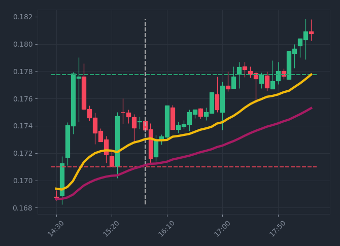
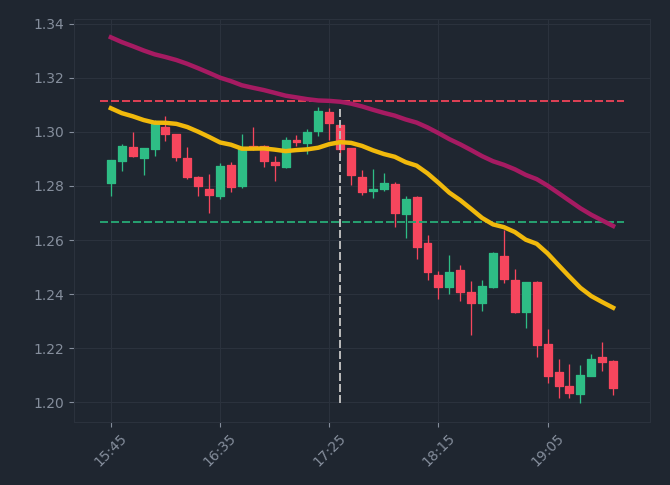
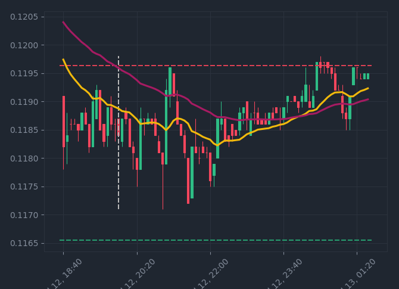
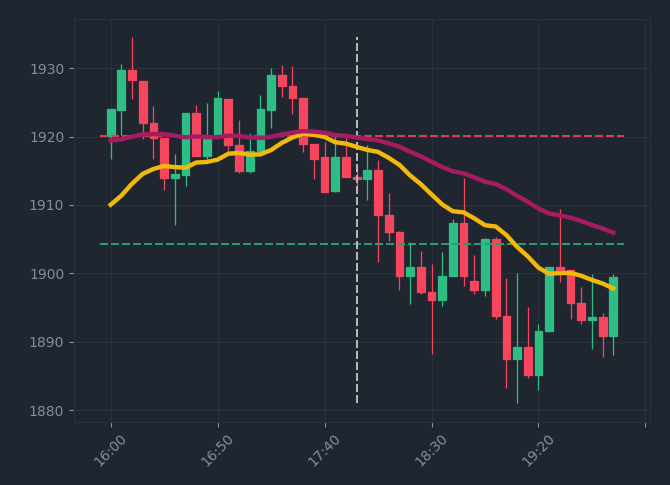
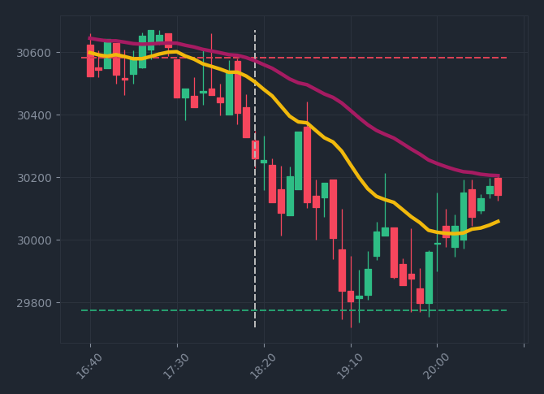
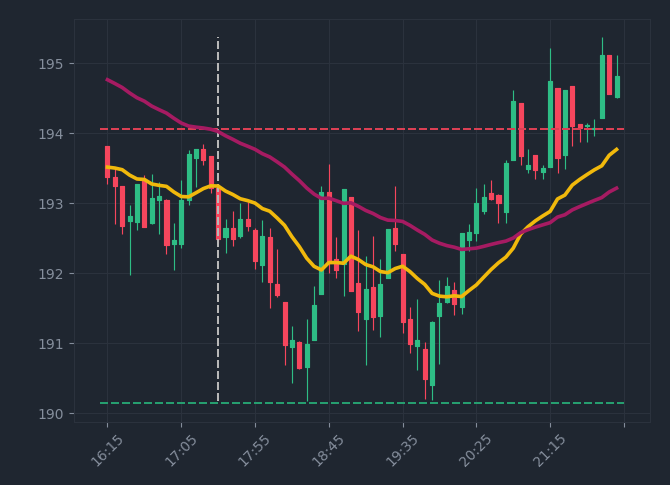
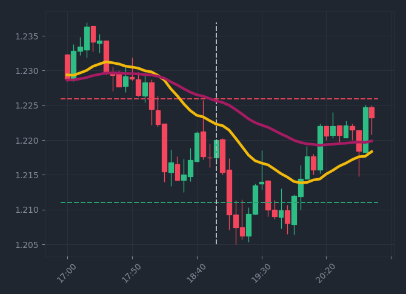
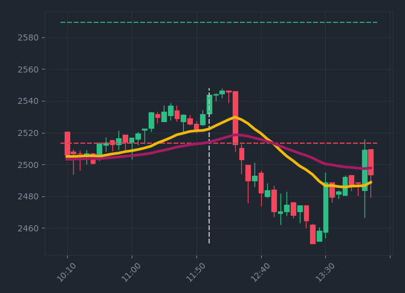
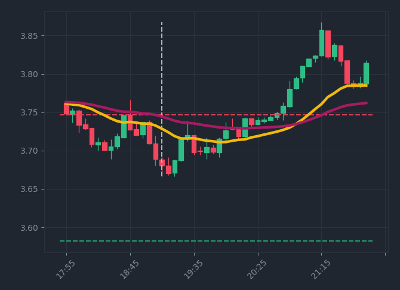
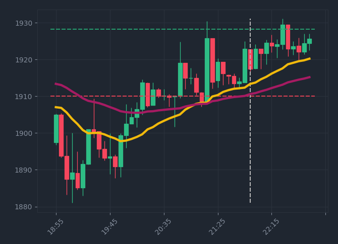

It can be seen how not all the trades are positive. More trade examples can be found in examples directory (around 1000 past trades). If anyone is interested in contributing, it can study the examples in order to see when the strategy fails and make improvements.

### Telegram bot examples

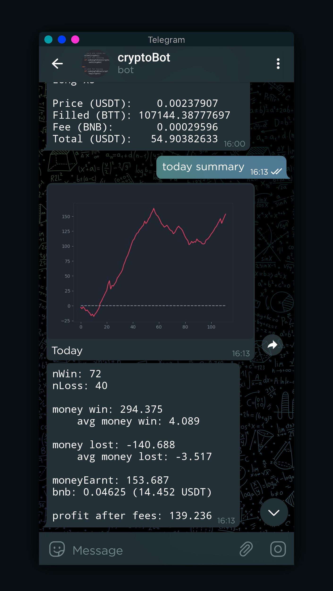
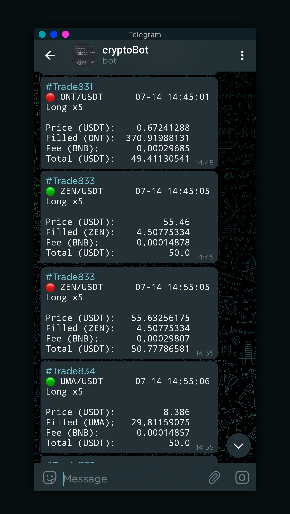
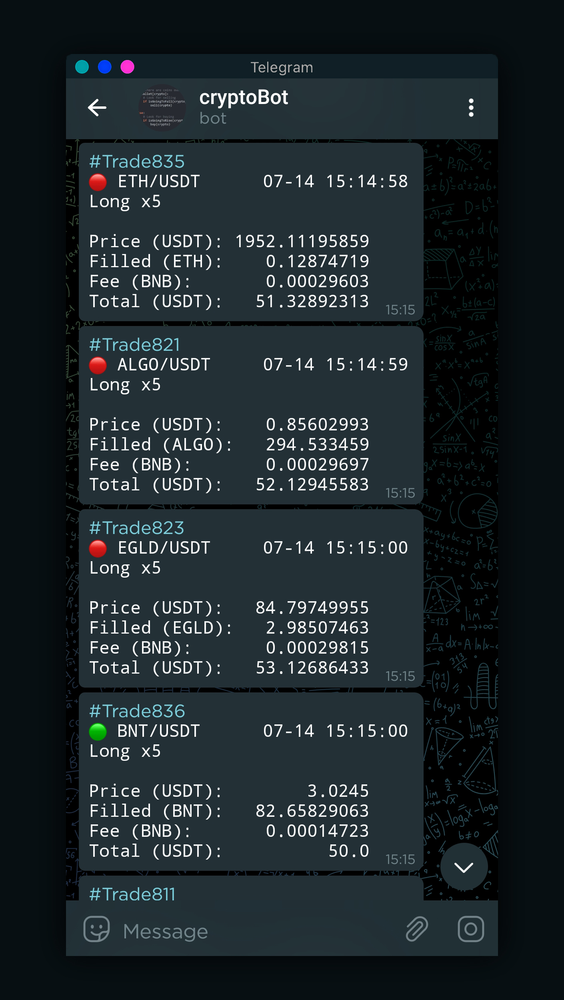
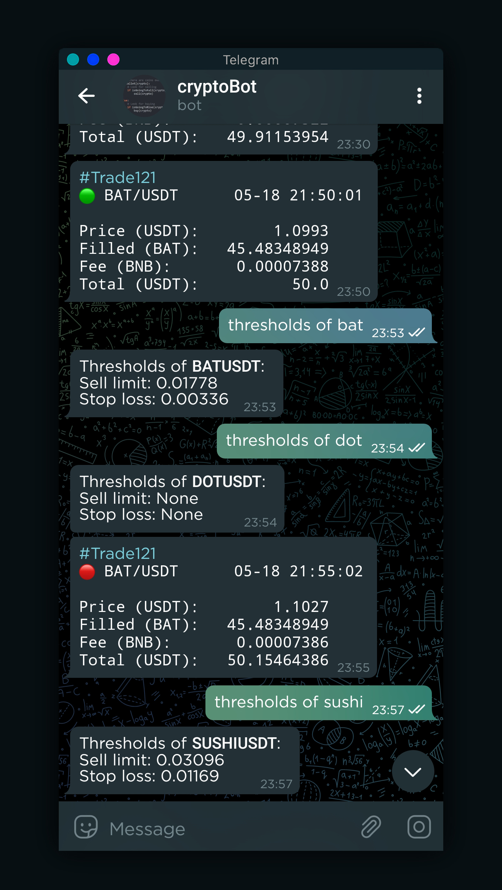
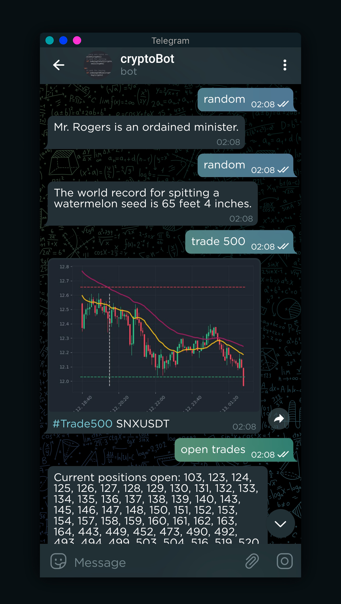

## Set up

### Install Python dependencies

Run the following line in the terminal: `pip install -r requirements.txt`.

You may create a `virtualenv` to execute this project, to know more about how to install and create virtualenvs visit [virtualenv](https://docs.python.org/3/library/venv.html).

### Create Telegram bot token

Skip this step if you only intend to use the bot without Telegram communication.

- Create a Telegram Account
- Start a new conversation with the [botfather](https://telegram.me/botfather)
- Send `/newbot` to create a new Telegram bot
- When asked, enter a name for the bot
- Give the Telegram bot a unique username. Note that the bot name must end with the word "bot" (case-insensitive)
- Save the Telegram bot's access token
- Put the access token in _telegram_bot.py_ file

### How to run the bot

- Run _telegram_bot.py_ in one console
- Run _crypto_bot_EMA.py_ in other console
- That's it! Now you can see the trades in the console or interact with the Telegram bot

## Authors

This project is created and maintained by David Pujalte.

## Disclaimer

This project is for informational and educational purposes only. The user must not use the project or anything related to it as investment, financial or other advice.

There is not any warranty that the information and materials contained in this project are accurate.

**USE AT YOUR OWN RISK!**

Under any circumstances will the author of the project be held responsible or liable in any way for claims, damages, losses, expenses, costs, or liabilities watsoever, including, without limitation, any direct or indirect damages for loss of profits.
